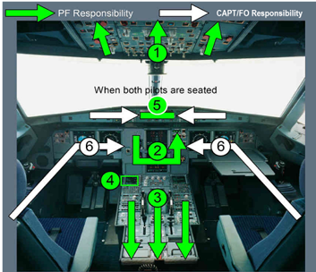

# Fenix A320 Flow

## Preliminary Cockpit Preperation

### Safety and Security

| Check                  | Status/Action/Action |
|------------------------|----------------------|
| Engine Master Switches | OFF                  |
| Engine Mode Selector   | Norm                 |
| Radar Sys Switch       | OFF                  |
| PWS Switch             | OFF                  |
| Gain Knob              | Cal                  |
| Multiscan Switch       | Auto                 |
| GCS Switch             | Auto                 |
| Landing Gear Lever     | Down Position          |
| Wiper Selectors        | OFF                  |

### Power Up

| Check                             | Status/Action|
|-----------------------------------|--------------|
| Battery Voltage                   | > 25.5V      |
| Battery 1/2                       | ON           |
| EXT Power                         | ON           |
| Wait for Boot Up                  | 3 Beeps      |
| If Weather Condition too hot/cold | Start APU    |
| Radio VHF 1/2/INT/CAB             | Listen ON    |
| APU Fire Test                     | Check        |
| APU Master Switch                 | ON           |
| After 3s APU Start                | ON           |
| When APU is Available             | Start Chrono |
| After 3min APU Bleed              | ON           |
| IRS 1/2/3                         | NAV          |
| Cockpit Lights                    | Adjust       |

### FMS Preinitilization

Note: Select the secondary nav data base on the A/C status
page to delete the whole flight plan.

| Check             | Status/Action |
|-------------------|---------------|
| AOC -> FLT INIT   | INIT DATA REQ |
| A/C Status/Action | Check         |
| INIT PAGE         | INIT REQUEST  |
| INIT PAGE         | FLT NBR       |

### Aircraft Status/Action

Note: If engine page is xxx then activate FADEC GND POWER at the upper overhead
panel. 0.5 oil per hour.

| Check                               | Status/Action           |
|-------------------------------------|-------------------------|
| RECALL                              | PRESS 3s                |
| Aircraft Configuration              | Check EFB               |
| Door Oxygen Page                    | > 1000psi               |
| Hydraulic Page                      | Arrow in the box        |
| Engine Page                         | Check Oil above minimum |
| Flap lever indication               | Matching                |
| Speedbrake                          | Retracted & Disarmed    |
| Parking Brake                       | Check Pressure          |
| Brake Check (Release Parking Brake) | Check                   |

### Preliminary Performance Calculation

Note: 200kg fuel = 5min flying. Normal Op: 1+F Take Off

| Check                | Status/Action     |
|----------------------|-------------------|
| Fuel Calc            | Check/Adjust      |
| EFB Mass/Weight      | Adjust/Load       |
| Take Off Performance | Adjust/Calc/Check |
| TOPL / Stop Margin   | Check             |
| Fuel Calc            | Check/Adjust      |

## Preflight Procedure

| Check                         | Status/Action                     |
|-------------------------------|-----------------------------------|
| Left Wiper                    | OFF                               |
| Crew Oxygen Supply            | ON                                |
| RCDR GND CTL Switch           | ON                                |
| RCDR CVR Test                 | Push Hold                         |
| EVAC Switch                   | CAPT                              |
| EXT LT Strobe                 | AUTO                              |
| EXT LT NAV & LOGO             | 1                                 |
| Seat Belts                    | ON(Refuel complete)               |
| No Smoking Signs              | AUTO                              |
| Emergency Exit                | ARM                               |
| Cabin Pressure LDG Elev       | AUTO                              |
| Air Condition Switches        | 12 o'clock                        |
| Batterys                      | Charge Check (OFF->ON ELEC PAGE)  |
| Fuel Pumps                    | ON(Refuel complete)               |
| Engine Fire Test              | Push Check (ECAM / Master Switch) |
| Right Wiper                   | OFF                               |
| Audio Control Panel PA Switch | Pulled                            |
| Standby Instrument            | Set QNH                           |
| TERR ON ND                    | OFF                               |
| BOTH DCDU                     | ON                                |
| Accumulator Pressure          | Check                             |
| Clock                         | Check Clock/Date                  |
| A/SKID Switch                 | Up Position                       |
| Frequencys                    | Set                               |
| Transponder                   | Standby                           |
| System                        | 1 (Pilot Flying)                  |
| ALT RPTG                      | ON                                |
| Squawk                        | 2000                              |
| TCAS Mode Selector            | Above                             |
| TCAS Indication               | Standby                           |

### FMS Preflight

Note: To check which VIA to choose -> Second MCDU FPLN-AIRPORT BUTTON- Check
where the STAR ends.\
When you dont have a CG enter 25.0 as a default.\
**BUG:** Add the Engine Out Procedure Waypoint at the 2nd waypoint
after the departure airport.

| Check                         | Status/Action                           |
|-------------------------------|-----------------------------------------|
| DATA-POS MONITOR-SEL NAVAIDS  | Deselect INOP Navaids                   |
| INIT-COST INDEX               | Set                                     |
| INIT-CRZ FL                   | Set                                     |
| INIT-TROPO                    | Set                                     |
| INIT-GND TEMP                 | Set                                     |
| F-PLN-DEPARTURE               | Set                                     |
| F-PLN-ARRIVAL                 | Set                                     |
| F-PLAN-VERT REV               | Insert Step Climb/Speed                 |
| F-PLAN Check                  | Mode Switch with CSTR ON                |
| DATA-NEXT-PILOT ROUTE         | Store Active / Check                    |
| SEC F-PLN                     | COPY ACTIVE                             |
| Engine Out Procedure          | Enter \[IATA\]X\[RUNWAY ROW\]           |
| NEW WAYPOINT PLACE/BRG/DIST   | Set (eg. EDDM26R/260/25)                |
| Holding at EOP waypoint       | Left Button @ EOP Enter RWY course      |
| Secondary Flightplan DEP DEST | Enter new DEST (NO STAR/NO VIA)         |
| SEC-FPLN-PERF-APPR PAGE       | Enter minimum altitude                  |
| F-PLAN-FIX INFO @ DEP Airport | Enter runway track radial (eg. EDDM26R) |
| F-PLAN-FIX INFO @ DEP Airport | Enter EOP waypoint (eg. MUCX4)          |
| RAD/NAV                       | Enter departure VOR etc.                |
| PROG Page                     | Check GPS Primary with HIGH ACCUR       |
| PROG Page                     | Enter runway (eg. EDDM26R)              |
| INIT-PERF                     | Enter Loadsheet/Flightplan data         |
| PERF Page                     | Calc and enter take off performance     |
| F-PLN                         | Check departure to the charts           |
| FCU Initial Climb Altitude    | Get initial climb from the charts       |
| Oxygen Test                   | Select INT COM                          |

## Before Start

| Check           | Status/Action                                 |
|-----------------|-----------------------------------------------|
| ATC             | Start & Pushback Clearance                    |
| External Power  | OFF                                           |
| Final Loadsheet | Enter data in FMS do new take off calculation |
| FMS Setup       | PF: Take off perf / PM: F-PLN                 |
| Transponder     | AUTO                                          |
| Beacon          | ON                                            |
| Checklist       | Read Before Start Checklist                   |
| Pushback        | Init Pushback                                 |

## Engine Start

| Check                | Status/Action               |
|----------------------|-----------------------------|
| Check Redline        | Check for init engine start |
| Engine Mode Selector | IGN/START                   |
| Engine Master Switch | 2 then 1                    |

## After Start

| Check                | Status/Action                       |
|----------------------|-------------------------------------|
| Engine Status        | Both Available                      |
| Engine Mode Selector | Norm                                |
| APU Bleed            | OFF                                 |
| Anti Ice             | As needed                           |
| APU Master           | OFF                                 |
| Spoilers             | ARM                                 |
| Rudder Trim          | Reset                               |
| Flaps                | Take off flaps                      |
| Pitch Trim           | Set Pitch from take off performance |
| ECAM Status          | Push STS Button and check           |
| Checklist            | Read After Start Checklist          |

## Taxi

Notes: Speed limits 10kts in turns, 15kts in approns and 30kts straight (50kts backtracking).\
Accelerate to 30kts brake down to 10kts and repeat to limit brake actions.

| Check         | Status/Action                                   |
|---------------|-------------------------------------------------|
| Control Check | F/CTL ECAM Page                                 |
| Pedal DISC    | DISC for rudder control                         |
| Pedal DISC    | Connect for taxi                                |
| ATC           | Taxi clearance                                  |
| EXT Lights    | RWY TURN OFF ON / Nose TAXI                     |
| Brake Check   | Check Accumulator for 0                         |
| Auto BRK      | MAX                                             |
| TERR ND       | As needed                                       |
| Weather Radar | Sys 1 / PWS ON                                  |
| Take Conf     | Push Take off conf button                       |
| Checklist     | Read Taxi Checklist                             |
| Line Up Flow  | Line Up Clearance received / TCAS TA/RA / PACKS |
| Checklist     | Read Line Up Checklist                          |

## Takeoff

| Check             | Status/Action                                             |
|-------------------|-----------------------------------------------------------|
| Strobe            | ON                                                        |
| Takeoff Clearance | Received                                                  |
| Landing Lights    | ON                                                        |
| Nose Light        | TO                                                        |
| Parking Brake     | Release / Anounce Takeoff                                 |
| Timer             | Set Clock & Chrono                                        |
| Thrust            | 50% stabelize                                             |
| Sidestick         | Half forward (full with much crosswind)                   |
| Thrust            | Flex of TOGA                                              |
| Callout           | MAN FLEX XX / SRS / Runway / Autothrust blue / Thrust set |
| @ 80kts           | Sidestick slightly to neutral                             |
| @ 100kts          | Callout Crosscheck                                        |
| Speeds            | Callout V1 / Rotate                                       |
| Pitch             | 15° (12.5° with engine failure)                           |
| Positive Climb    | Callout Positive Climb                                    |
| Gear              | UP                                                        |
| NAV               | Callout checked                                           |
| LVR CLB flashing  | Thrust lever to CLB position                              |
| Packs             | ON with 10s between each pack                             |
| Above S Speed     | Flaps Retracted / Spoilers Disarm / Nose Light & RWY OFF  |
| Altitude          | Set                                                       |
| QNH               | Set by passing transition altitude                        |
| Check             | Flaps / Spoilers / Engine Selectors / Gear UP / Packs ON  |

## Climb

| Check     | Status/Action                                                     |
|-----------|-------------------------------------------------------------------|
| @ 10000ft | Landing Lights OFF / Seatbelts OFF (<7.5° Pitch / No Turbulence)  |
| EFIS      | Adjust                                                            |
| FMS       | RAD/NAV Clear / Sec F_PLN Copy Active / Fix Info Clear / PROG Adj |
| Anti Ice  | Check Clouds / TAT <= 10°C                                        |
